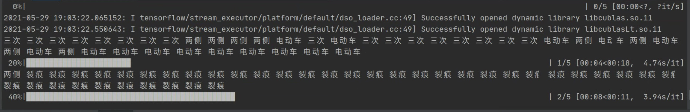
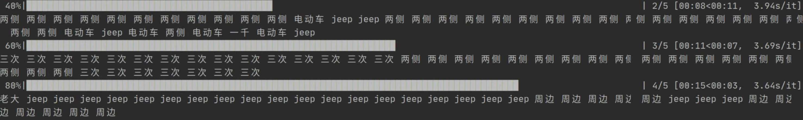
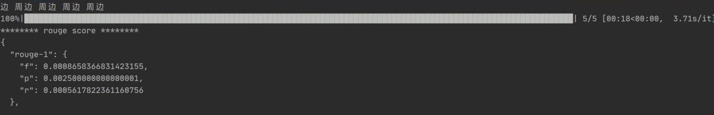
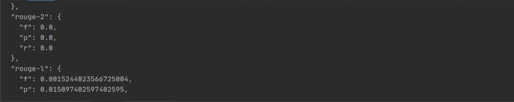
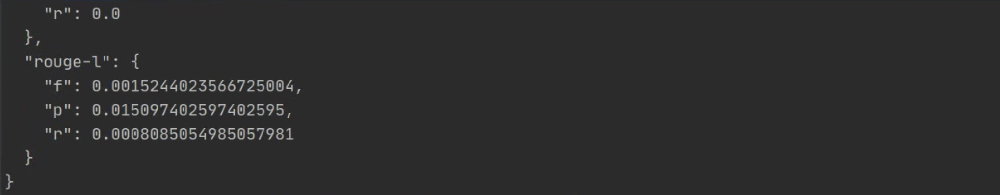

1 补全 layers.transformer.scaled_dot_product_attention 计算 self-attention 函数

+ 在src文件夹中的pgn_transformer_tf2文件夹中，找到layers子文件夹，并在其中的transformer.py文件中找到scaled_dot_product_attention 函数，补全代码如下：

```python
def scaled_dot_product_attention(q, k, v, mask):
    """计算注意力权重。
    q, k, v 必须具有匹配的前置维度。
    k, v 必须有匹配的倒数第二个维度，例如：seq_len_k = seq_len_v。
    虽然 mask 根据其类型（填充或前瞻）有不同的形状，
    但是 mask 必须能进行广播转换以便求和。
    
    参数:
        q: 请求的形状 == (..., seq_len_q, depth)
        k: 主键的形状 == (..., seq_len_k, depth)
        v: 数值的形状 == (..., seq_len_v, depth_v)
        mask: Float 张量，其形状能转换成
            (..., seq_len_q, seq_len_k)。默认为None。
        
    返回值:
        输出，注意力权重
    """

    # ------------------------------------------------------------------------------
    # 补全代码
    # 使用 matmul 计算 q 和 k， 得到结果 matmul_qk
    # 缩放 matmul_qk
    # 使用根号 k 缩放 matmul_qk，注意要先对 k 值进行类型转换，得到 scaled_attention_logits
    # ------------------------------------------------------------------------------
    matmul_qk  = tf.matmul(q,k,transpose_b=True)

    # 缩放matmul_qk
    dk = tf.cast(tf.shape(k)[-1], tf.float32)
    scaled_attention_logits = matmul_qk / tf.math.sqrt(dk)

    # 将 mask 加入到缩放的张量上。
    if mask is not None:
        scaled_attention_logits += (mask * -1e9)

    # ------------------------------------------------------------------------------
    # 补全代码
    # 对 scaled_attention_logits 做 softmax 操作，得到注意力权重 attention_weights
    # 使用 attention_weights 对 v 做加权求和
    # ------------------------------------------------------------------------------

    # softmax 在最后一个轴(seq_len_k)上归一化，因此分数想家等于１
    attention_weights = tf.nn.softmax(scaled_attention_logits, axis=-1)

    output = tf.matmul(attention_weights, v)

    return output, attention_weights
```


2 补全 layers.transformer.MultiHeadAttention.call 函数的代码

在src文件夹中的pgn_transformer_tf2文件夹中，找到layers子文件夹，并在其中的transformer.py文件中找到MultiHeadAttention类，并在其中的call函数中补全代码如下：

```python
class MultiHeadAttention(tf.keras.layers.Layer):
    def __init__(self, d_model, num_heads):
        super(MultiHeadAttention, self).__init__()
        self.num_heads = num_heads
        self.d_model = d_model

        assert d_model % self.num_heads == 0

        self.depth = d_model // self.num_heads

        self.wq = tf.keras.layers.Dense(d_model)
        self.wk = tf.keras.layers.Dense(d_model)
        self.wv = tf.keras.layers.Dense(d_model)

        self.dense = tf.keras.layers.Dense(d_model)

    def split_heads(self, x, batch_size):
        """分拆最后一个维度到 (num_heads, depth).
        转置结果使得形状为 (batch_size, num_heads, seq_len, depth)
        """
        x = tf.reshape(x, (batch_size, -1, self.num_heads, self.depth))
        return tf.transpose(x, perm=[0, 2, 1, 3])

    def call(self, v, k, q, mask):
        batch_size = tf.shape(q)[0]

        q = self.wq(q)  # (batch_size, seq_len, d_model)
        k = self.wk(k)  # (batch_size, seq_len, d_model)
        v = self.wv(v)  # (batch_size, seq_len, d_model)
        # ----------------------------------------------------------------------------------------
        # 补全代码
        # 分别对 q、k、v 使用 self.split_heads 函数，分拆成多头
        # 使用 scaled_dot_product_attention 函数计算注意力，得到 scaled_attention 和 attention_weights
        # ----------------------------------------------------------------------------------------

        q = self.split_heads(q, batch_size)
        k = self.split_heads(k, batch_size)
        v = self.split_heads(v, batch_size)
        scaled_attention, attention_weights = scaled_dot_product_attention(q, k, v, mask)


        scaled_attention = tf.transpose(scaled_attention,
                                        perm=[0, 2, 1, 3])  # (batch_size, seq_len_q, num_heads, depth)

        concat_attention = tf.reshape(scaled_attention,
                                      (batch_size, -1, self.d_model))  # (batch_size, seq_len_q, d_model)

        output = self.dense(concat_attention)  # (batch_size, seq_len_q, d_model)

        return output, attention_weights
```

3 补全 encoders.self_attention_encoder.EncoderLayer.call 函数，完成 encoder 计算流程

在src文件夹中的pgn_transformer_tf2文件夹中，找到 encoders子文件夹，并在其中的self_attention_encoder.py文件中找到EncoderLayer类，并在其中的call函数中补全代码如下：

```python
class EncoderLayer(tf.keras.layers.Layer):
    def __init__(self, d_model, num_heads, dff, rate=0.1):
        super(EncoderLayer, self).__init__()

        self.mha = MultiHeadAttention(d_model, num_heads)
        self.ffn = point_wise_feed_forward_network(d_model, dff)

        self.layernorm1 = tf.keras.layers.LayerNormalization(epsilon=1e-6)
        self.layernorm2 = tf.keras.layers.LayerNormalization(epsilon=1e-6)

        self.dropout1 = tf.keras.layers.Dropout(rate)
        self.dropout2 = tf.keras.layers.Dropout(rate)

    def call(self, x, training, mask):
        # ------------------------------------------------------------------------------
        # 补全代码
        # 对 x 使用多头注意力机制 
        # 使用 dropout 层
        # 使用 layernorm 层
        # 使用 ffn
        # 使用 dropout2
        # 使用 layernorm 层
        # ------------------------------------------------------------------------------

        attn_output, _ = self.mha(x, x, x, mask)
        attn_output = self.dropout1(attn_output, training=training)
        out1 = self.layernorm1(x + attn_output)
        ffn_output = self.ffn(out1)
        ffn_output = self.dropout2(ffn_output, training=training)
        out2 = self.layernorm2(out1 + ffn_output)

        return out2
```


4 使用 bin.main.py 运行模型，调整超参

+ 在src文件夹中的pgn_transformer_tf2文件夹中，找到 bin子文件夹，并在其中的main.py调整使用GPU的参数，这里设置要从2改为0，表明我们现在使用服务器中的第一个GPU，由于我们目前能够跑的GPU只有一个，所以参数只能设置为0。估计老师比较豪，有3个以上的GPU，所以才能设置为2，修改之后的代码如下：

```python
if __name__ == '__main__':
    os.environ['CUDA_VISIBLE_DEVICES'] = '0'
    main()
```


在终端运行```python -m src.pgn_transformer_tf2.bin.main```，则会出现以下的测试的结果和ROUGE评测指标相关结果。  







